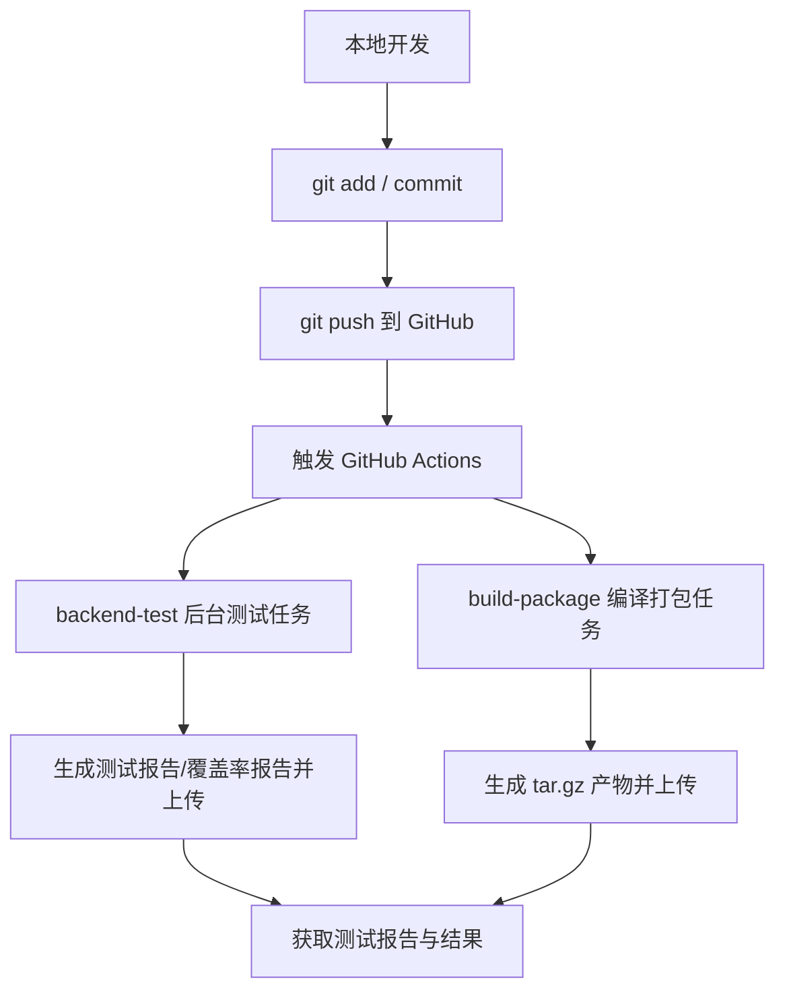

# 持续集成测试实验报告

## 一、实验目的

1. 理解持续集成（Continuous Integration，CI）的核心概念与价值；
2. 掌握从「代码开发 → Git 提交 → 持续集成自动测试 → 获取测试报告」的完整流程；
3. 学会在 CI 系统中配置**自动编译和打包**任务；
4. 学会在 CI 系统中配置**后台测试任务**并**获取测试报告**；
5. 通过「故意引入错误 → 测试失败 → 修复 → 测试通过」的演示，体会测试用例对业务逻辑的守护作用。

## 二、实验环境

| 项目 | 说明 |
| --- | --- |
| 代码仓库 | GitHub：https://github.com/wenzaee/ecsm-controller |
| 编程语言 | Go 1.26（本地 macOS arm64，CI 为 ubuntu-latest） |
| CI 平台 | GitHub Actions（.github/workflows/ci.yml） |
| 项目构成 | 3 个可执行程序：`ecsm-controller`、`rosedb-dump`、`desired-vsoa-client`，14 个代码包 |
| 构建工具 | Makefile（make build / make test / make coverage） |

## 三、实验原理

持续集成要求开发人员频繁地将代码合并到主干分支，每次提交都自动触发**编译、测试和打包**。其核心价值在于：

- **快速反馈**：代码问题在提交后几分钟内即可被发现，避免问题累积；
- **质量门槛**：在 CI 中设置覆盖率阈值等质量检查，不达标即阻止合并；
- **产物标准化**：自动编译打包并生成带校验和的发布产物，保证可复现；
- **报告自动化**：后台测试任务自动生成测试报告、覆盖率报告，供开发人员下载查阅。

测试用例的本质是**业务逻辑的守护者**：一旦业务代码被误改（例如判断方向颠倒、分支丢失），测试会立刻以失败给出告警，防止错误逻辑进入线上环境。

## 四、实验内容与步骤

### 4.1 建立 GitHub 项目并初始化

在 GitHub 上创建仓库 `wenzaee/ecsm-controller`，本地初始化 Go 工程：

```bash
git init
go mod init github.com/wenzaee/ecsm-controller
# 编写 cmd/ 下的三个程序入口与 pkg/ 下的业务模块
git remote add origin https://github.com/wenzaee/ecsm-controller.git
```

项目采用分层结构：`pkg/` 存放业务包（registry 期望状态存储、reconciler 收敛逻辑、ecsmclient 平台客户端等），`cmd/` 存放可执行程序，`configs/` 存放配置样例。

### 4.2 编写测试用例

为全部业务包编写单元测试（表驱动测试 + 真实依赖集成测试），并用 `go tool cover` 检查覆盖率：

```bash
make test        # 运行全部单元测试
make coverage    # 生成覆盖率报告（func 文本 + HTML）
```

实验结果为 **14 个代码包、143 个测试用例、语句覆盖率 100%**，覆盖了控制器核心业务：期望状态写入/查询、期望-实际差异计算（创建/启动/停止/扩缩容）、工作队列、定时巡检、平台 API 调用及全部错误分支。

其中最关键的业务测试是 `pkg/reconciler/reconciler_test.go` 中的 `TestCompareDesiredActual`，它用表驱动方式验证控制器最核心的收敛决策逻辑 `CompareDesiredActual`（期望状态与实际状态比对后，应执行创建、启动、停止还是扩缩容），主要用例包括：

| 用例 | 场景 | 期望动作 |
| --- | --- | --- |
| start creates missing service | 期望 start，实际不存在 | 创建（need_create） |
| start starts stopped service | 期望 start，实际已停止 | 启动（need_start） |
| start scales out before starting | 期望 3 副本，实际 1 副本 | 扩容（need_scale_out） |
| start scales in | 期望 2 副本，实际 3 副本 | 缩容（need_scale_in） |
| stop stops running service | 期望 stop，实际运行中 | 停止（need_stop） |
| matching running service needs no action | 期望与实际一致 | 无动作（none） |

### 4.3 配置 CI：自动编译和打包

在 `.github/workflows/ci.yml` 中配置 `build-package` job，实现「代码提交后自动编译并打包，产物上传供下载」：

```yaml
  build-package:
    name: Compile and package
    needs: backend-test          # 测试通过后才进行打包
    runs-on: ubuntu-latest
    steps:
      - uses: actions/checkout@v4
      - uses: actions/setup-go@v5
        with:
          go-version-file: go.mod
      - name: Compile binaries
        run: make build          # 编译三个程序到 bin/
      - name: Package binaries
        run: |
          mkdir -p artifacts
          tar -czf artifacts/ecsm-controller-linux-amd64.tar.gz -C bin .
          sha256sum artifacts/ecsm-controller-linux-amd64.tar.gz > artifacts/SHA256SUMS
      - name: Upload package
        uses: actions/upload-artifact@v4   # 打包产物可作为发布件下载
        with:
          name: ecsm-controller-linux-amd64
          path: artifacts/
```

要点：

- `make build` 完成三个程序的自动编译；
- `tar.gz + SHA256SUMS` 生成带完整性校验的发布包；
- `upload-artifact` 将产物上传到 GitHub Actions，运行结束后可在「Artifacts」区下载。

### 4.4 配置 CI：后台测试任务并获取测试报告

配置 `backend-test` job，每次提交后**在后台运行全部测试**，并自动生成与上传测试报告：

```yaml
  backend-test:
    name: Backend tests and report
    runs-on: ubuntu-latest
    steps:
      - name: Run unit tests and collect raw report
        id: tests
        run: |
          set +e
          go test -json -coverprofile=artifacts/coverage.out ./... | tee artifacts/test-results.json
          test_exit_code=${PIPESTATUS[0]}
          echo "exit_code=$test_exit_code" >> "$GITHUB_OUTPUT"
          exit 0
      - name: Create coverage reports
        if: always()
        run: |
          go tool cover -func=artifacts/coverage.out | tee artifacts/coverage.txt
          go tool cover -html=artifacts/coverage.out -o artifacts/coverage.html
          go run ./tools/testsummary \
            --input artifacts/test-results.json \
            --coverage artifacts/coverage.txt \
            --exit-code "${{ steps.tests.outputs.exit_code }}" \
            --output artifacts/test-summary.md
          cat artifacts/test-summary.md >> "$GITHUB_STEP_SUMMARY"
      - name: Upload test report
        if: always()
        uses: actions/upload-artifact@v4
        with:
          name: backend-test-report
          path: artifacts/
```

要点：

- `go test -json` 输出结构化测试事件，即使测试失败也保留完整结果（`exit 0` + 记录真实退出码）；
- 项目自研 `tools/testsummary` 工具将 JSON 测试事件汇总为可读的 Markdown 测试报告；
- `GITHUB_STEP_SUMMARY` 把报告摘要直接展示在 Actions 运行页面上；
- 覆盖率不达标时 CI 自动失败（质量门槛）。

### 4.5 演示测试的作用：故意引入错误 → 测试失败 → 修复 → 通过

本步骤通过「故障注入」方式演示测试用例如何守护业务逻辑。

**第 1 步：故意把业务代码改错**

打开文件 `pkg/reconciler/reconciler.go`，找到 `CompareDesiredActual` 函数中 `case registry.DesiredActionStart` 分支下的扩缩容判断，把返回值故意颠倒（该扩容时返回缩容）：

```go
// 正确代码（改前）：
if actualReplicas < desired.Replicas {
    return DiffNeedScaleOut          // 实际副本不足 → 扩容
}
if actualReplicas > desired.Replicas {
    return DiffNeedScaleIn           // 实际副本过多 → 缩容
}

// 错误代码（改后）：返回值颠倒
if actualReplicas < desired.Replicas {
    return DiffNeedScaleIn           // 错误：实际副本不足却返回缩容
}
if actualReplicas > desired.Replicas {
    return DiffNeedScaleOut          // 错误：实际副本过多却返回扩容
}
```

**第 2 步：运行测试，观察失败**

执行：

```bash
go test ./pkg/reconciler/ -run TestCompareDesiredActual -v
```

测试立即捕获错误，输出如下：

```
--- FAIL: TestCompareDesiredActual (0.00s)
    --- FAIL: TestCompareDesiredActual/start_scales_out_before_starting (0.00s)
    --- FAIL: TestCompareDesiredActual/start_scales_in (0.00s)
FAIL
FAIL    github.com/wenzaee/ecsm-controller/pkg/reconciler
```

**第 3 步：分析失败原因**

- `start_scales_out_before_starting` 失败：期望 3 副本、实际 1 副本，正确动作是扩容（need_scale_out），错误代码却返回了缩容；
- `start_scales_in` 失败：期望 2 副本、实际 3 副本，正确动作是缩容（need_scale_in），错误代码却返回了扩容；
- 该错误若进入线上环境，控制器会对运行中的服务执行**与需求完全相反的操作**（该扩容时缩容，导致服务容量不足甚至不可用），后果严重；而表驱动测试在提交后数秒内即可将其拦截。

**第 4 步：修复代码**

把 `pkg/reconciler/reconciler.go` 中 `CompareDesiredActual` 的两处返回值改回正确逻辑：

```go
if actualReplicas < desired.Replicas {
    return DiffNeedScaleOut
}
if actualReplicas > desired.Replicas {
    return DiffNeedScaleIn
}
```

**第 5 步：重新运行测试，确认通过**

```bash
go test ./pkg/reconciler/ -v
```

输出：

```
ok      github.com/wenzaee/ecsm-controller/pkg/reconciler
```

全部用例通过，业务代码恢复正常。演示结论：**测试用例能够即时发现业务逻辑的错误修改**，这正是持续集成中测试环节的核心价值。

### 4.6 组织「开发 → 提交 → CI 测试」流程

1. 本地开发并验证：`make test`、`make build`；
2. `git add` / `git commit` 提交代码；
3. `git push` 推送到 GitHub，自动触发 `ci.yml`（push 或 pull_request 事件）；
4. GitHub Actions 自动运行 `backend-test` 与 `build-package` 两个任务；
5. 在 Actions 页面查看测试结果、覆盖率门槛、测试报告摘要，并可下载测试报告与打包产物。



## 五、实验结果

### 5.1 测试作用演示结果（4.5 节）

| 阶段 | 操作 | 结果 |
| --- | --- | --- |
| 改错后 | `go test ./pkg/reconciler/ -run TestCompareDesiredActual -v` | **失败**：2 个用例（扩缩容方向）被拦截 |
| 修复后 | `go test ./pkg/reconciler/` | **通过**：全部用例恢复通过 |

### 5.2 本地完整模拟 CI 流程（与 ci.yml 步骤一致）

| 步骤 | 命令 | 结果 |
| --- | --- | --- |
| 后台测试 | `go test -json -coverprofile=coverage.out ./...` | 通过，退出码 0 |
| 生成覆盖率 | `go tool cover -func / -html` | 语句覆盖率 **100.0%** |
| 生成测试报告 | `go run ./tools/testsummary ...` | 成功 |
| 自动编译 | `make build` | 3 个程序全部编译成功 |
| 打包 | `tar -czf ... && sha256sum ...` | 产物 + SHA256 校验生成 |

### 5.3 测试报告核心内容（test-summary.md）

| 指标 | 结果 |
| --- | ---: |
| 测试节点 | 143 |
| 通过 | 143 |
| 失败 | 0 |
| 跳过 | 0 |
| 已扫描代码包 | 14 |
| 测试执行耗时 | 1.39 秒 |
| 语句覆盖率 | 100.0% |

报告还包含各代码包通过/失败/跳过/耗时明细表、失败用例详情（含输出）、通过/跳过用例清单，以及覆盖率 HTML 交互报告。

### 5.4 CI 产物清单（artifacts）

- `backend-test-report`（测试报告）：test-results.json、coverage.txt、coverage.html、test-summary.md；
- `ecsm-controller-linux-amd64`（发布包）：tar.gz 压缩包 + SHA256SUMS 校验文件。

## 六、结果分析

1. **测试任务后台化**：CI 在独立运行器（ubuntu-latest）上执行测试，开发者无需本地复现，143 个用例 1.39 秒内完成，反馈及时；
2. **编译打包自动化**：`make build` + tar 打包 + SHA256 校验链完整，产物可直接用于部署或发布；
3. **质量门槛生效**：覆盖率阈值检查保证新增代码不会显著拉低覆盖率，低于 70% 时任务失败，阻止低质量代码合入；
4. **测试报告可获取**：Markdown 报告实时展示在 Actions 页面（Step Summary），完整报告与 HTML 覆盖率可通过 Artifacts 下载，满足"获取测试报告"的实验要求；
5. **失败不吞没**：`-json` 输出 + 显式记录退出码，测试失败时报告仍然生成且工作流正确标记为失败；
6. **测试守护业务逻辑**：4.5 节演示表明，即使是一处判断方向的细微错误，表驱动测试也能在数秒内准确定位失败用例（该扩缩容用例），充分体现测试用例对业务逻辑的守护作用，也说明测试用例必须覆盖真实业务场景才有价值。

## 七、实验总结

本次实验完整实践了「代码开发 → Git 提交 → 持续集成自动编译打包与后台测试 → 获取测试报告」的闭环流程：

- 掌握了 GitHub Actions 工作流的编写方法（事件触发、job 编排、步骤依赖、条件执行）；
- 实现了自动编译打包（make build + tar.gz + 校验和）与产物上传；
- 实现了后台测试任务（go test -json + 覆盖率门槛）与测试报告生成/上传/展示；
- 通过「故意引入错误 → 测试失败 → 修复 → 通过」的完整演示，直观理解了测试用例对业务逻辑的守护作用，以及持续集成在其中的价值。

实验证明：持续集成能够在每次代码提交后自动完成编译、测试、打包和报告，是快速演化的开源软件保证质量与发布效率的必要基础设施；而高质量的测试用例是这套机制能够真正发挥作用的基石。
