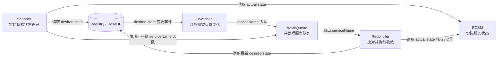

# ECSM Controller

`ecsm-controller` 是一个基于 desired state 的 ECSM 服务控制器。

它的核心目标是：外部系统只需要写入“期望状态”，控制器负责持续观察、比对并推动 ECSM 中的实际服务状态向期望状态收敛。

例如，外部系统写入：

```json
{
  "service_name": "c_worker@1.1.0",
  "action": "start",
  "replicas": 3
}
```

控制器会将它保存到 Registry 中，然后通过 Watcher、Scanner 和 Reconciler 等组件完成后续处理。

## 核心架构



一句话理解：

> Registry 管期望，Watcher 监听变化，Scanner 定期兜底，WorkQueue 负责排队，Reconciler 负责判断和收敛，ECSM Client 负责真正操作平台。

## 组件说明

### Registry

Registry 是期望状态中心，当前使用 RoseDB 作为本地 KV 存储。

它主要保存两类数据：

- `DesiredState`：外部系统写入的期望状态，例如服务应该启动、停止、运行几个副本。
- `ServiceStatus`：控制器观察到的服务收敛状态，便于后续审计和排查。

### Watcher

Watcher 是变化监听器。

它监听 Registry 中 desired state 的变化。当某个服务被更新或删除时，Watcher 不直接操作 ECSM，而是只把 `serviceName` 放入工作队列。

这样可以保证实际处理逻辑统一交给 Reconciler 完成。

### Scanner

Scanner 是定时巡检器。

它会周期性读取 Registry 中的期望状态，同时读取 ECSM 中的实际状态。如果发现两边不一致，就把对应的 `serviceName` 放入工作队列。

Scanner 的作用是兜底：即使某次事件通知丢失，控制器也能通过定时扫描重新发现问题。

### WorkQueue

WorkQueue 是任务缓冲队列。

Watcher 和 Scanner 都会把需要处理的服务放入队列，Worker 再从队列中逐个取出服务进行处理。

它可以避免多个状态变化同时发生时直接冲击后端逻辑。

### Reconciler

Reconciler 是状态收敛器，也是控制器的核心执行逻辑。

它会根据服务名重新读取最新的 desired state，再读取 ECSM 中的 actual state，然后计算差异并决定下一步动作。

当前支持的内部收敛动作包括：

- `need_create`：服务不存在，需要创建。
- `need_start`：服务存在但未运行，需要启动。
- `need_stop`：服务正在运行，但期望停止。
- `need_scale_out`：实际副本数少于期望副本数，需要扩容。
- `need_scale_in`：实际副本数多于期望副本数，需要缩容。
- `none`：期望状态和实际状态一致，无需处理。

### ECSM Client

ECSM Client 是 ECSM 平台操作入口。

它负责读取 ECSM 当前服务状态，并根据 Reconciler 计算出的动作调用 ECSM API 执行创建、启动、停止或扩缩容。

## 工作流程

### 1. 写入期望状态

外部系统通过 VSOA RPC 写入 desired state：

```text
/desired_state/update
```

请求示例：

```json
{
  "service_name": "c_worker@1.1.0",
  "action": "start",
  "replicas": 3
}
```

### 2. Registry 保存状态

VSOA 服务接收到请求后，会将 desired state 写入 RoseDB。

### 3. Watcher 触发处理

Registry 发生变化后，Watcher 监听到事件，将对应服务名放入 WorkQueue。

### 4. Scanner 定期兜底

Scanner 周期性比对 Registry 中的 desired state 和 ECSM 中的 actual state。

如果发现不一致，也会将服务名放入 WorkQueue。

### 5. Reconciler 执行收敛

Worker 从队列取出服务名，交给 Reconciler 处理。

Reconciler 会重新读取最新 desired state 和 actual state，计算差异并调用 ECSM Client 执行动作。

## 项目目录

```text
.
├── cmd
│   ├── ecsm-controller        # 控制器主程序
│   ├── desired-vsoa-client    # VSOA desired state 命令行客户端
│   └── rosedb-dump            # RoseDB 调试工具
├── configs
│   └── demo.yaml              # 示例配置
├── pkg
│   ├── app                    # 应用组装与生命周期管理
│   ├── config                 # 配置加载
│   ├── desiredwatcher         # desired state 变化监听
│   ├── ecsmclient             # ECSM API 客户端
│   ├── queue                  # 工作队列
│   ├── reconciler             # 状态比对与收敛
│   ├── registry               # desired/status 存储抽象与 RoseDB 实现
│   ├── scanner                # 定时巡检
│   └── vsoa                   # VSOA RPC 服务
├── VSOA_API.md                # VSOA API 文档
├── KV_STORAGE_DESIGN.md       # KV 存储设计说明
├── Makefile
└── go.mod
```

## 快速开始

### 构建

```bash
make build
```

构建产物会输出到 `bin` 目录：

```text
bin/ecsm-controller
bin/desired-vsoa-client
bin/rosedb-dump
```

### 启动控制器

```bash
go run ./cmd/ecsm-controller -config configs/demo.yaml
```

或使用构建后的二进制：

```bash
./bin/ecsm-controller -config configs/demo.yaml
```

### 写入 desired state

```bash
go run ./cmd/desired-vsoa-client \
  -action update \
  -service c_worker@1.1.0 \
  -desired-action start \
  -replicas 3
```
```bash
./desired-vsoa-client -action update  -service c_worker_2@1.1.0 -desired-action start  -replicas 3
```
或：

```bash
./bin/desired-vsoa-client \
  -action update \
  -service c_worker@1.1.0 \
  -desired-action start \
  -replicas 3
```

### 查询 desired state

查询单个服务：

```bash
./bin/desired-vsoa-client \
  -action query \
  -service c_worker@1.1.0
```

查询全部服务：

```bash
./bin/desired-vsoa-client -action list
```

### 查看 RoseDB 数据

```bash
./bin/rosedb-dump -config configs/demo.yaml
```

只查看 desired state：

```bash
./bin/rosedb-dump \
  -action list \
  -prefix desired/services/
```

注意：RoseDB 同一个目录同一时间只能被一个进程打开。如果控制器正在运行并占用同一个 RoseDB 目录，`rosedb-dump` 可能会打开失败。

## 配置说明

示例配置位于 `configs/demo.yaml`：

```yaml
registry:
  rosedb:
    dir_path: /tmp/ecsm-controller-demo
    sync: false
    watch_queue_size: 1024

vsoa:
  listen_addr: ":13447"
  password: ""

ecsm:
  scheme: http
  ip: 192.168.50.82
  port: 3001
  timeout_seconds: 5

scanner:
  interval_seconds: 30
```

字段说明：

| 字段 | 说明 |
| --- | --- |
| `registry.rosedb.dir_path` | RoseDB 数据目录 |
| `registry.rosedb.sync` | 是否同步刷盘 |
| `registry.rosedb.watch_queue_size` | desired state 监听事件队列大小 |
| `vsoa.listen_addr` | VSOA 服务监听地址 |
| `vsoa.password` | VSOA 连接密码 |
| `ecsm.scheme` | ECSM API 协议，通常为 `http` |
| `ecsm.ip` | ECSM 服务地址 |
| `ecsm.port` | ECSM API 端口 |
| `ecsm.timeout_seconds` | ECSM API 请求超时时间 |
| `scanner.interval_seconds` | Scanner 定时扫描周期 |

## VSOA API

详细 API 请查看 [VSOA_API.md](./VSOA_API.md)。

当前主要接口：

| 路径 | Method | 说明 |
| --- | --- | --- |
| `/desired_state/healthz` | GET | 健康检查 |
| `/desired_state/update` | SET | 写入或更新服务 desired state |
| `/desired_state/delete` | SET | 删除服务 desired state |
| `/desired_state/query` | GET | 查询单个服务 desired state |
| `/desired_state/list` | GET | 查询全部 desired state |

## 设计原则

本项目采用 desired state controller 模式：

- 外部系统只表达“想要什么状态”。
- 控制器负责持续观察当前状态。
- 当期望状态和实际状态不一致时，控制器自动执行收敛。
- Watcher 提供实时触发，Scanner 提供周期性兜底。
- Reconciler 在真正执行前总是重新读取最新 desired state，避免使用过期事件。

这种模式可以降低外部系统和 ECSM 操作细节之间的耦合，也让服务状态具备持续自修正能力。

